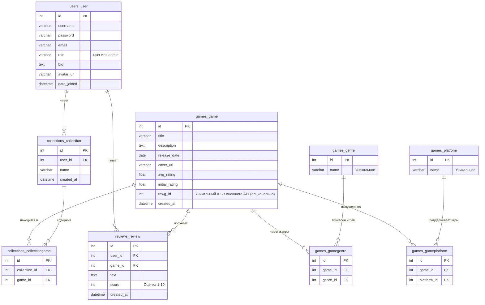

# Документация проекта GameVault

Проект **GameVault** представляет собой веб-приложение для каталогизации видеоигр, написания отзывов и создания пользовательских коллекций. 
Проект имеет клиент-серверную архитектуру: **Backend** реализован на фреймворке Django (Python) с использованием Django REST Framework, **Frontend** — на React (TypeScript, Vite). База данных — PostgreSQL.

Ниже представлен подробный разбор структуры проекта, назначения каждого из ключевых файлов и схемы базы данных.

---

## 1. Структура Backend (Django)

Директория `backend/` содержит серверную часть приложения, которая предоставляет REST API для фронтенда.

### 1.1 `backend/config/`
Это директория конфигурации всего Django-проекта.
- **`settings.py`**: Главный файл настроек проекта. Содержит конфигурацию базы данных (PostgreSQL), установленные приложения (`INSTALLED_APPS`), настройки безопасности, конфигурацию для JWT авторизации (`rest_framework_simplejwt`) и параметры CORS.
- **`urls.py`**: Главный роутер проекта. Определяет корневые URL-адреса и подключает URL-маршруты из отдельных приложений (apps).
- **`wsgi.py`**: Точка входа для WSGI-совместимых веб-серверов (например, Gunicorn) для деплоя приложения.

### 1.2 `backend/apps/`
Вся бизнес-логика разбита на независимые Django-приложения.

#### Приложение `users` (Пользователи)
Отвечает за учетные записи пользователей и аутентификацию.
- **`models.py`**: Определяет кастомную модель пользователя `User`, наследуемую от `AbstractUser`. Добавляет поля: `role` (user/admin), `bio` (биография), `avatar_url`.

#### Приложение `games` (Игры)
Управляет каталогом игр, жанрами и платформами.
- **`models.py`**: Описывает основные сущности:
  - `Game`: Модель игры (название, описание, дата выхода, обложка, рейтинги, RAWG ID). Имеет метод `update_avg_rating()` для автоматического пересчета среднего рейтинга на основе отзывов.
  - `Genre`: Справочник жанров.
  - `Platform`: Справочник платформ (PC, PlayStation и т.д.).
  - `GameGenre` и `GamePlatform`: Промежуточные модели для связи многие-ко-многим между играми, жанрами и платформами.

#### Приложение `collections` (Коллекции)
Позволяет пользователям собирать игры в свои списки (например, "Пройдено", "Хочу сыграть").
- **`models.py`**: 
  - `Collection`: Сама коллекция (привязана к пользователю, имеет название).
  - `CollectionGame`: Промежуточная модель, связывающая конкретную коллекцию и конкретную игру.

#### Приложение `reviews` (Отзывы)
Логика написания отзывов и выставления оценок играм.
- **`models.py`**:
  - `Review`: Модель отзыва. Содержит текст, оценку (от 1 до 10) и связь с пользователем и игрой. Переопределенные методы `save()` и `delete()` вызывают пересчет рейтинга игры (`update_avg_rating()`) при любом изменении отзыва.

### 1.3 Другие важные файлы backend'а
- **`manage.py`**: Утилита командной строки для управления проектом Django (запуск сервера, создание миграций и т.д.).
- **`requirements.txt`**: Список зависимостей Python (Django, DRF, psycopg2 и др.).
- **`pytest.ini` / `conftest.py` / `tests/`**: Конфигурация и директория для написания автоматизированных тестов с использованием `pytest`.
- **`Dockerfile`**: Инструкции для сборки Docker-образа бэкенда.

---

## 2. Структура Frontend (React / Vite)

Директория `frontend/` содержит клиентское приложение. Используемый стек: React 18, TypeScript, Vite, Tailwind CSS, Zustand (стейт-менеджмент).

### 2.1 Корень frontend/
- **`package.json`**: Конфигурация npm-проекта, список зависимостей и скрипты (`dev`, `build`).
- **`vite.config.ts`**: Настройки сборщика Vite (плагины, алиасы, настройки dev-сервера).
- **`tailwind.config.js` / `postcss.config.js`**: Конфигурация Tailwind CSS, где определяются темы, цвета и плагины для стилизации.

### 2.2 `frontend/src/` (Исходный код)
- **`main.tsx`**: Точка входа в React-приложение. Рендерит корневой компонент `App` в DOM.
- **`App.tsx`**: Главный компонент, который содержит настройку роутинга (React Router) и базовую структуру страницы (Header, Footer, область контента).
- **`index.css`**: Глобальные стили, в первую очередь директивы Tailwind (`@tailwind base`, `@tailwind components`, `@tailwind utilities`).

#### Директория `api/`
Отвечает за взаимодействие с Backend API.
- **`client.ts`**: Настройка Axios-клиента, интерсепторы для добавления JWT-токенов в заголовки запросов и обработка ошибок.
- **`auth.ts`, `games.ts`, `collections.ts`, `reviews.ts`**: Функции для выполнения конкретных API-запросов, разбитые по доменам (авторизация, получение списка игр, работа с коллекциями и т.д.).

#### Директория `store/`
Глобальное состояние приложения с использованием Zustand.
- **`auth.ts`**: Хранит состояние авторизации (токены, данные текущего пользователя).
- **`theme.ts`**: Управление темой (светлая/темная, если предусмотрено).

#### Директория `pages/` (Страницы)
Компоненты, представляющие целые страницы маршрутизатора.
- **`Home.tsx`**: Главная страница.
- **`Catalog.tsx`**: Каталог игр с возможностью фильтрации и пагинации.
- **`GameDetails.tsx`**: Страница конкретной игры с подробной информацией, отзывами и возможностью добавить в коллекцию.
- **`Profile.tsx`**: Профиль пользователя, его коллекции и отзывы.
- **`Login.tsx` & `Register.tsx`**: Страницы авторизации и регистрации.
- **`AdminPanel.tsx`**: Панель администратора для управления контентом.

#### Директория `components/` (Переиспользуемые компоненты)
- **`Header.tsx` & `Footer.tsx`**: Шапка и подвал сайта.
- **`GameCard.tsx`**: Карточка игры (обложка, название, рейтинг) для отображения в сетке.
- **`RatingStars.tsx`**: Компонент для визуализации рейтинга (звездочки).
- **`Pagination.tsx`**: Компонент постраничной навигации.
- **`ProtectedRoute.tsx`**: HOC (Higher-Order Component) для защиты маршрутов, доступных только авторизованным пользователям.
- **`LoadingSpinner.tsx`**: Индикатор загрузки.

---

## 3. Схема базы данных

Ниже представлена ER-диаграмма (Entity-Relationship), описывающая структуру таблиц в PostgreSQL.

### Описание связей
1. **Пользователь (User)**:
   - Может создавать множество коллекций (`1:N` с `Collection`).
   - Может писать множество отзывов (`1:N` с `Review`).
2. **Игра (Game)**:
   - Связана с жанрами отношением "многие-ко-многим" (реализуется через `GameGenre`).
   - Связана с платформами отношением "многие-ко-многим" (реализуется через `GamePlatform`).
   - Может иметь множество отзывов (`1:N` с `Review`). На одну игру пользователь может оставить только один отзыв (уникальное ограничение `user_id`, `game_id`).
3. **Коллекция (Collection)**:
   - Принадлежит одному пользователю.
   - Может содержать множество игр ("многие-ко-многим" через `CollectionGame`).
4. **Отзыв (Review)**:
   - Привязан к одному пользователю и одной игре. Оценка строго валидируется в диапазоне от 1 до 10.

## 4. Описание API ручек (Endpoints)

Все API работают по префиксу `/api/` и большинство закрытых ручек требуют авторизации с помощью JWT токена (передается в заголовке `Authorization: Bearer <token>`).

### Авторизация и пользователи (`/api/auth/`)
- `POST /api/auth/register/` — Регистрация нового пользователя.
- `POST /api/auth/login/` — Авторизация (возвращает `access` и `refresh` токены).
- `POST /api/auth/refresh/` — Обновление `access` токена по `refresh` токену.
- `GET /api/auth/me/` — Получение данных текущего авторизованного пользователя (включая его коллекции и отзывы).
- `GET /api/auth/users/<id>/` — Получение публичного профиля другого пользователя.

### Игры (`/api/games/`)
*Используются стандартные роутеры DRF (ViewSet), поэтому доступны все CRUD операции.*
- `GET /api/games/` — Получение списка игр с поддержкой фильтрации (по жанрам, платформам), поиска (по названию) и пагинации.
- `POST /api/games/` — Добавление новой игры (только для администраторов).
- `GET /api/games/<id>/` — Получение детальной информации об игре.
- `PUT / PATCH / DELETE /api/games/<id>/` — Редактирование или удаление игры (только для админов).
- `GET /api/games/genres/` — Получение списка всех жанров.
- `GET /api/games/platforms/` — Получение списка всех платформ.

### Коллекции (`/api/collections/`)
- `GET /api/collections/` — Получение списка коллекций текущего пользователя.
- `POST /api/collections/` — Создание новой коллекции.
- `GET /api/collections/<id>/` — Получение данных конкретной коллекции.
- `POST /api/collections/<id>/add_game/` (ожидаемый роут) — Добавление игры в коллекцию.
- `POST /api/collections/<id>/remove_game/` (ожидаемый роут) — Удаление игры из коллекции.
- `DELETE /api/collections/<id>/` — Удаление самой коллекции.

### Отзывы (`/api/reviews/`)
- `GET /api/reviews/my/` — Получение всех отзывов, оставленных текущим авторизованным пользователем.
- `GET /api/reviews/games/<game_id>/reviews/` — Получение списка всех отзывов к конкретной игре.
- `POST /api/reviews/games/<game_id>/reviews/` — Оставление отзыва (оценки и текста) к игре.
- `GET / PUT / DELETE /api/reviews/<id>/` — Просмотр, редактирование или удаление конкретного отзыва (удалять и редактировать может только автор или администратор).

---

## 5. Документация API (Swagger / OpenAPI)

В проекте реализована автогенерируемая документация к API с помощью библиотеки `drf-spectacular`. Она автоматически читает сериализаторы (Serializers) и представления (Views) из Django REST Framework и генерирует схему по стандарту OpenAPI 3.0.

Доступные роуты для документации:
- **`GET /api/docs/`** — Классический интерактивный **Swagger UI**. Позволяет посмотреть все доступные ручки, ожидаемые тела запросов (Request Body) и ответы (Responses). Прямо оттуда можно делать тестовые запросы (кнопка *Try it out*).
- **`GET /api/redoc/`** — Документация в формате **ReDoc**. Менее интерактивный, но более строгий и читаемый формат документации, который отлично подходит для изучения структуры API.
- **`GET /api/schema/`** — Сама схема в формате YAML/JSON, которую можно экспортировать в Postman или другие инструменты.

---

## 6. Откуда берутся данные (Интеграция с RAWG)

Изначально база данных пуста. В панели администратора на фронтенде реализован функционал для удобного импорта данных (игр, обложек, жанров, платформ) из внешнего API — **RAWG.io** (крупнейшая база данных видеоигр).
В модели игры (`games_game`) даже предусмотрено специальное поле `rawg_id`, чтобы избегать дубликатов при повторном импорте. Администратор может искать игры через внешний API прямо в панели и в один клик переносить их в локальную базу данных GameVault.

---
## Дополнительно
- В корне проекта находится файл `docker-compose.yml`, который поднимает все необходимые сервисы (backend, frontend, базу данных PostgreSQL, и, возможно, другие вспомогательные сервисы) для удобной локальной разработки или деплоя.
- Имеется `.env` файл для настройки секретов, доступов к БД и других переменных окружения.
